# Raytracer

A physically based rendering engine written in C++17, built as an Epitech
second year Object Oriented Programming project. It ships two independent
render engines (a Whitted style recursive raytracer and a Monte Carlo path
tracer), a BVH acceleration structure, a multithreaded tile renderer, a live
SFML preview with an interactive ImGui scene editor, and a fully dynamic
plugin system for primitives, materials, textures, mesh loaders and denoisers.

Scenes are described in plain text `.cfg` files using the libconfig format.

## Gallery

All images below were rendered by this engine. The path traced scenes were
run at 25 to 100 samples per pixel and then passed through the Intel Open
Image Denoise plugin.

<table>
  <tr>
    <td width="50%">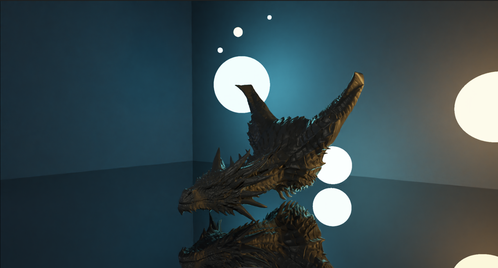</td>
    <td width="50%">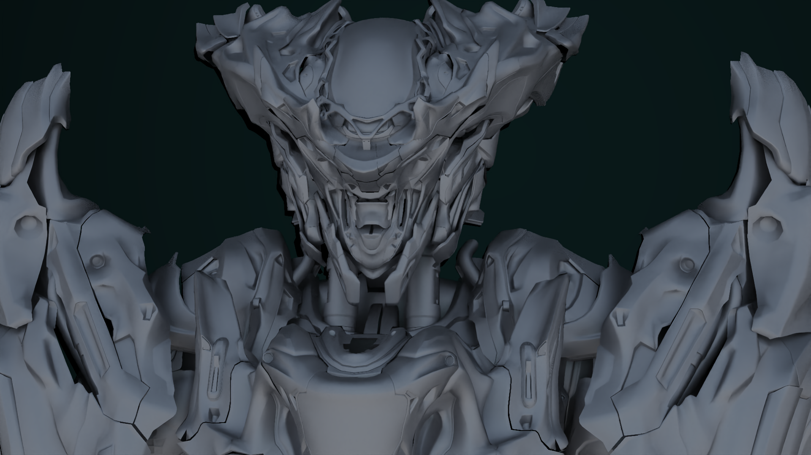</td>
  </tr>
  <tr>
    <td>Dragon head lit by emissive spheres</td>
    <td>Mech bust, high polygon OBJ mesh</td>
  </tr>
  <tr>
    <td width="50%">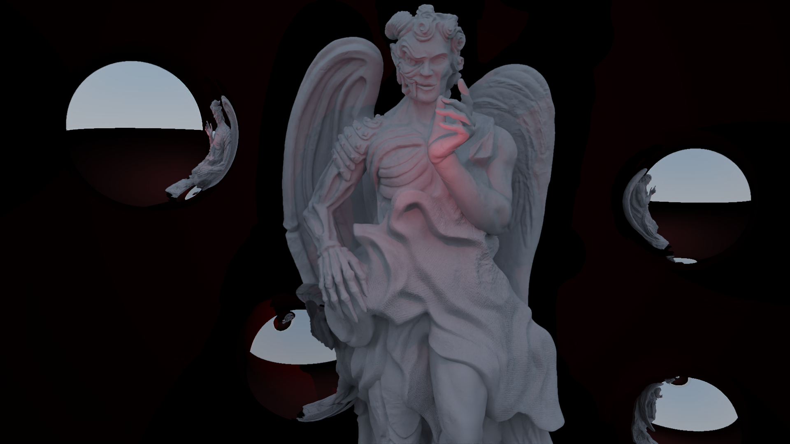</td>
    <td width="50%">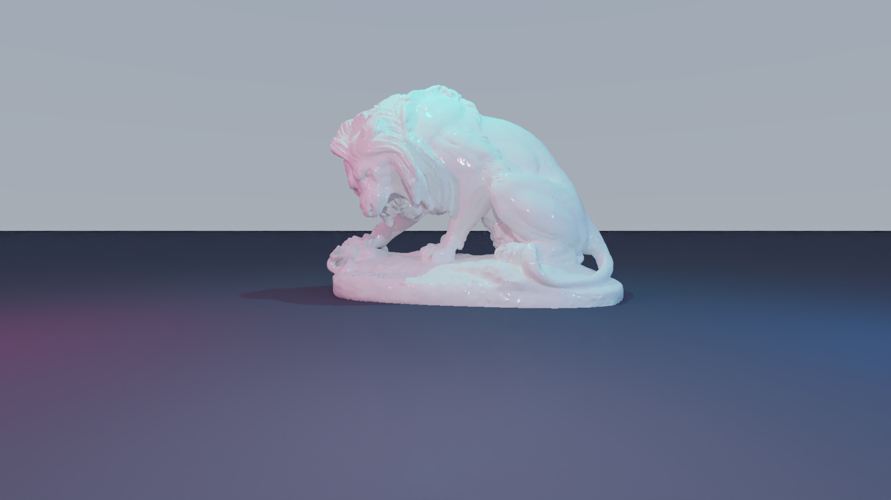</td>
  </tr>
  <tr>
    <td>Angel statue with reflective spheres</td>
    <td>Lion statue, glossy marble material</td>
  </tr>
  <tr>
    <td width="50%">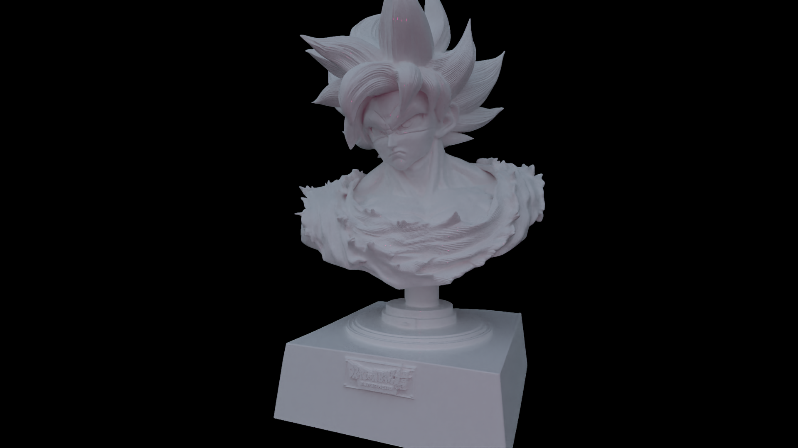</td>
    <td width="50%">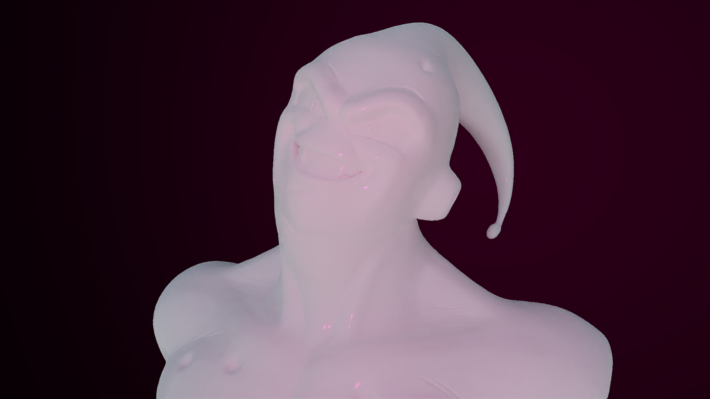</td>
  </tr>
  <tr>
    <td>Character bust, 100 spp path traced</td>
    <td>Character bust, soft indirect lighting</td>
  </tr>
  <tr>
    <td width="50%">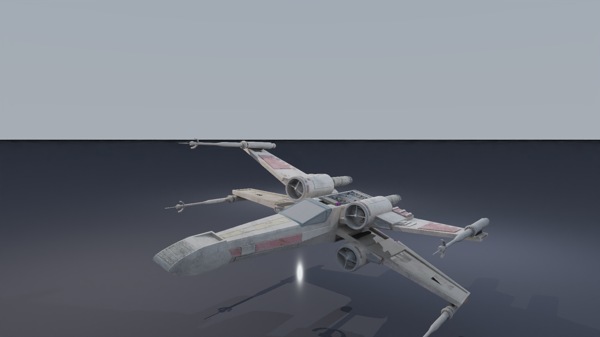</td>
    <td width="50%">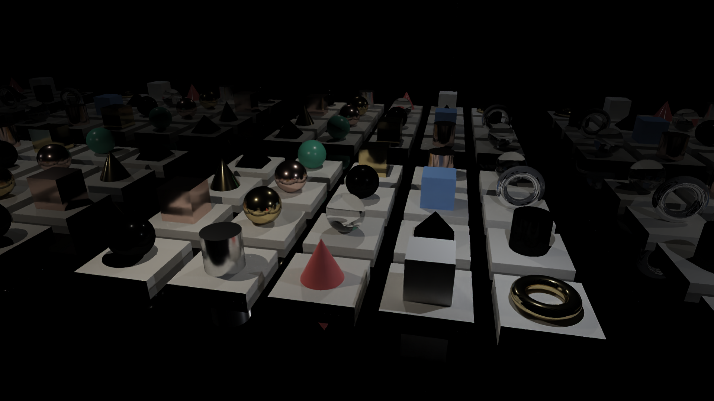</td>
  </tr>
  <tr>
    <td>Textured starfighter on a mirror floor</td>
    <td>Material and primitive showcase grid</td>
  </tr>
  <tr>
    <td width="50%">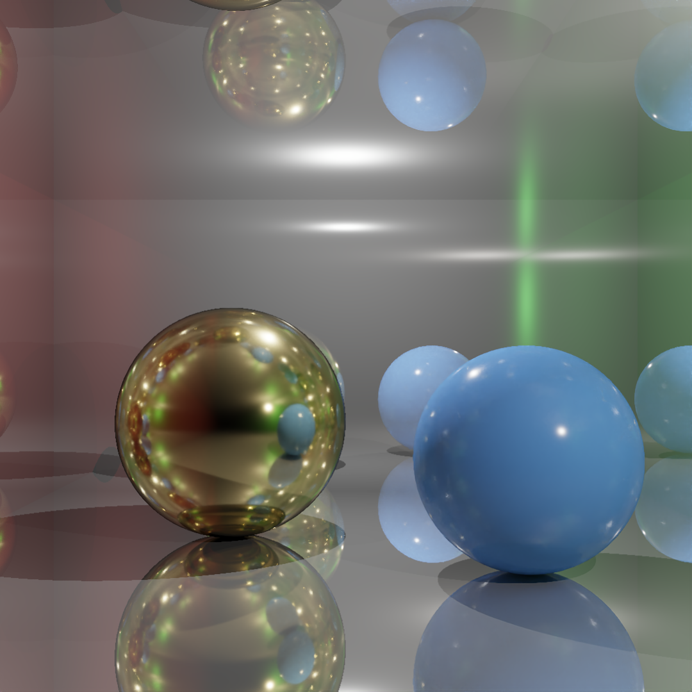</td>
    <td width="50%">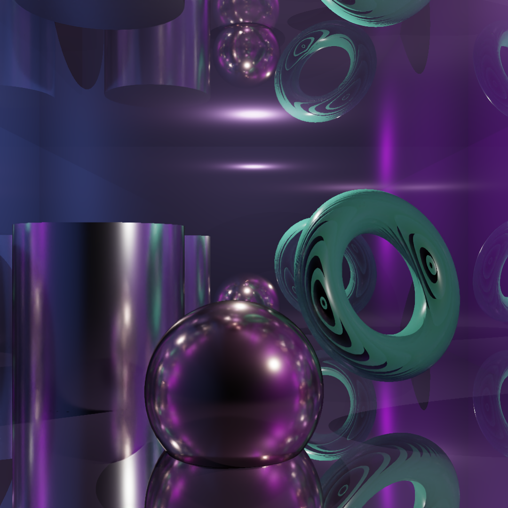</td>
  </tr>
  <tr>
    <td>Cornell box, metal and dielectric spheres</td>
    <td>Reflective room, PBR jade, marble and aluminum</td>
  </tr>
</table>

<p align="center">
  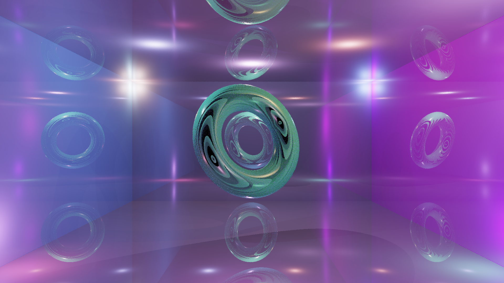
  <br>
  <em>Glass tori in a colored mirror room</em>
</p>

### Denoising

The engine can call a denoiser plugin after rendering. The pair below is the
same 100 samples per pixel path traced frame, before and after the Open Image
Denoise pass.

<table>
  <tr>
    <td width="50%"></td>
    <td width="50%"></td>
  </tr>
  <tr>
    <td>Raw render, 100 spp</td>
    <td>After denoising</td>
  </tr>
</table>

## Features

### Rendering

- Whitted style recursive raytracer: direct lighting, hard shadows, recursive
  reflection and refraction, deterministic and fast.
- Monte Carlo path tracer: physically accurate global illumination, soft
  shadows, color bleeding, next event estimation, cosine weighted hemisphere
  sampling and Russian Roulette path termination.
- Bounding Volume Hierarchy with a Surface Area Heuristic split, reducing ray
  intersection cost from linear to logarithmic.
- Tile based multithreaded rendering across all available cores.
- Progressive display: the image refines on screen while it renders.
- Tone mapping and gamma correction on the final buffer.
- Anti-aliasing (supersampling) and thin lens depth of field with configurable
  aperture and focus distance.

### Geometry

- Built in primitives: sphere, plane.
- Plugin primitives: box, cone, cylinder, torus (signed distance field),
  pyramid, triangle.
- Mesh loaders: Wavefront OBJ (with MTL materials and texture resolution) and
  STL (ASCII and binary), both loaded as plugins.

### Materials and textures

- Flat (Lambert plus Phong specular), reflective, glossy.
- Transparent dielectric with presets for glass, water and diamond index of
  refraction.
- Emissive and emissive diffuse area lights.
- Physically based material using a Cook Torrance BRDF, with more than twenty
  named presets such as `pbr_gold`, `pbr_chrome`, `pbr_jade`, `pbr_marble`,
  `pbr_rubber` and `pbr_ceramic`.
- Textures: solid color, procedural checker, image texture (PNG and JPG).

### Lights

- Ambient, point, directional.

### Interactive mode

When the engine opens a window (the default), it runs an interactive session:

- Fly the camera through the scene with the keyboard.
- Edit the live scene through ImGui panels: a Scene Inspector, a Lights panel
  and a Camera panel, plus dialogs to add primitives and lights. Changes
  trigger an immediate re-render.
- Hot reload: edit the `.cfg` file in your editor and the engine reloads the
  scene automatically when the file changes on disk.
- Save the current frame to the output image at any time.

### Denoising

- Intel Open Image Denoise plugin (bundled), for a fast high quality result.
- Simple box denoiser plugin as a dependency free fallback.
- `denoise_tool`, a standalone binary that denoises an existing PPM image.

### Architecture

- Every primitive, material, texture, mesh loader, denoiser and the UI overlay
  is a separate shared object loaded at runtime from the `plugins` directory.
- A factory and registry layer maps scene file type keys to plugin
  constructors, so new content types can be added without touching the core.
- All plugin boundaries are defined by pure virtual interfaces in
  `include/rt/interfaces`.

## Build

### Requirements

- CMake 3.20 or newer
- A C++17 compiler (GCC or Clang)
- SFML 2 (graphics, window, system)
- libconfig++
- Dear ImGui and imgui-sfml, fetched automatically by CMake
- Open Image Denoise 2.2.2, bundled under `plugins/denoiser/oidn`

On Debian or Ubuntu:

```sh
sudo apt install cmake g++ libsfml-dev libconfig++-dev
```

### Compiling

```sh
cmake -S . -B build
cmake --build build -j
```

The build places `raytracer` and `denoise_tool` at the repository root and all
plugin shared objects in the `plugins` directory. The engine looks for
`./plugins` relative to the working directory, so run it from the repository
root.

## Usage

```sh
./raytracer <scene_file> [output_file] [options]
```

`<scene_file>` is the only required argument. Any non flag argument after it is
treated as the output path (default `output.ppm`).

| Option | Description |
|---|---|
| `--path-tracing` | Use the Monte Carlo path tracer instead of the Whitted raytracer |
| `--samples N` | Samples per pixel for the path tracer (default 64, minimum 1) |
| `--denoise` | Run a denoiser plugin after rendering |
| `--no-display` | Render straight to a file without opening a window |
| `--single-thread` | Render on a single thread (useful for debugging) |

Examples:

```sh
# Interactive preview with the Whitted raytracer
./raytracer scenes/cornell_1.cfg

# Offline path traced render, 100 spp, denoised, written to out.ppm
./raytracer scenes/angel.cfg out.ppm --path-tracing --samples 100 --denoise --no-display

# Denoise an existing image
./denoise_tool output.ppm output_denoised.ppm
```

Output is written in ASCII PPM (P3).

### Interactive controls

| Key | Action |
|---|---|
| Arrow Up / I | Move forward |
| Arrow Down / K | Move backward |
| Q / E | Strafe left / right |
| Space / C | Move up / down |
| Arrow Left / Right, J / L | Yaw left / right |
| U / O | Pitch up / down |
| S | Save the current frame to the output file |
| R | Reload the scene from disk |
| Escape | Close the window |

## Scene files

Scenes use the libconfig format and have three top level sections: `camera`,
`objects` and `lights`. A short example:

```cfg
camera = {
    position     = [0.0, 1.0, 4.5];
    lookAt       = [0.0, 1.0, 0.0];
    up           = [0.0, 1.0, 0.0];
    fov          = 40.0;
    width        = 800;
    height       = 800;
    antialiasing = 4;      # optional, samples per axis
    aperture     = 0.05;   # optional, enables depth of field
    focus_distance = 4.0;  # optional
};

objects = (
    {
        type = "plane";
        point = [0.0, 0.0, 0.0];
        normal = [0.0, 1.0, 0.0];
        color = [0.8, 0.8, 0.8];
    },
    {
        type = "sphere";
        center = [0.0, 1.0, 0.0];
        radius = 1.0;
        material = "pbr_gold";
    },
    {
        type = "obj";
        path = "obj/lion/lion.obj";
        scale = [1.0, 1.0, 1.0];
        material = "pbr_marble";
    }
);

lights = (
    { type = "ambient"; color = [1.0, 1.0, 1.0]; intensity = 0.2; },
    { type = "point"; position = [2.0, 4.0, 2.0]; color = [1.0, 1.0, 1.0]; intensity = 15.0; }
);

renderer = "pathtracer";
samples = 50;
```

Ready made scenes live in the `scenes` directory, including `cornell_1.cfg`,
`cornell_2.cfg`, `angel.cfg`, `lion_showcase.cfg`, `xwing_showcase.cfg`,
`dragon_showcase.cfg`, `knight_cyberpunk.cfg`, `primitives_showcase_fast.cfg`
and `checker_demo.cfg`.

Full documentation of the format, the renderers, the math layer and the plugin
system is in the `Documentations` directory.

## Project layout

```
src/                core engine (math, scene, renderers, BVH, display, app)
include/rt/          public headers and plugin interfaces
plugins/src/         plugin sources (primitives, materials, textures, loaders, UI, denoisers)
plugins/             compiled plugin shared objects and the bundled OIDN library
scenes/              example scene files
obj/                 example meshes
textures/            example textures
Documentations/      technical documentation
screenshots/         rendered images
```
